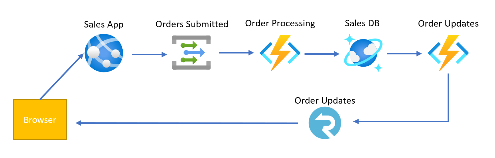

# azure-order-ingestion
An example of an order ingestion pipeline using Azure PaaS and Serverless offerings.

## Architecture

1. **Sales App** - Allows users to create fake batches of orders. You could easily have many order producers such as FTP files that process with new orders, APIs pushing orders, etc.
   * *Azure App Service (.NET Core 3.1)*
   * Sends orders to the **Orders Submitted** topic.
   * ASP.NET Core App that provides both the Angular App and the backing API for the Angular App
1. **Orders Submitted** - The primary ingestion point for all orders in the system.
   * *Azure Event Grid Topic*
1. **Order Processing** - The primary processing point for orders. Fakes a processing and shipping process for each order.
   * *Azure Functions App (Java 8)*
   * Subscribes to the **Orders Submitted** topic as an Event Grid trigger.
   * Outputs results to **Sales DB** Orders container.
1. **Sales DB** - Contains all processed orders in the system.
   * *Azure Cosmos DB (SQL API)*
   * Stores orders in the Orders container.
1. **Order Updates** - Updates order producers when orders are updated (shipped) in the system.
   * *Azure Functions App (JavaScript)* and *Azure SignalR*
   * Subscribes to the **Sales DB** change feed as a trigger and pushes out messages through the SignalR websocket connections.
   * The Functions App negotiates http websocket requests for SignalR.
